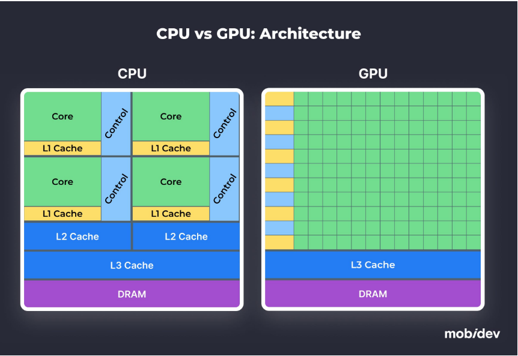
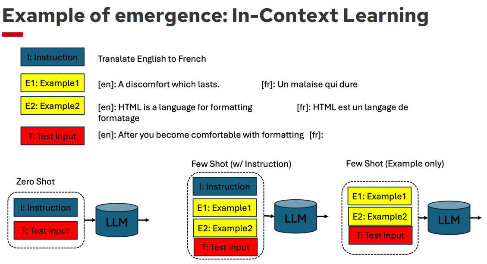

# Lecture 22: Unsupervised Pretraining of LLMs

layout: distill
title: Lecture Notes Template
description: An example of a distill-style lecture notes that showcases the main elements.
date: 2025-04-24

lecturers:
  - name: Ben Lengerich
    url: "https://lengerichlab.github.io/"

authors:
  - name: Joshua Salinas

  - name: Mitchell Stephens

---

## Announcements

- Project presentations: April 29 and May 1.
- Submit peer review forms on Canvas each day to earn up to 2% bonus.
- Due by: Friday, May 2.

---

## Unsupervised Training of LLMs

### Maximum Likelihood Estimation (MLE)

- GPT models maximize the likelihood of observed sequences:

  $\max_{\theta} \sum_{i=1}^T \log P_{\theta}(x_i \mid x_{<i})$

- This is a Directed Probabilistic Graphical Model.
- Predicting even simple tokens (e.g., "is" in a factual sentence) requires grammar, factual knowledge, and context resolution.
- Positional encodings are added to input embeddings to provide sequence order information.

---

### Historical Context

- MLE-based models have existed since 2007.
- 2007 Google MLE-based language model had 2 trillion tokens and 300 billion n-grams.
- Early models focused on n-grams, not embeddings.
- Lack of deep representation and contextual modeling.
- The LLM breakthrough came with transformers, large datasets, and GPU acceleration.

---

### GPU Importance

- CPUs typically have 4-8 cores with complex control units.
- GPUs split tasks across hundreds of simpler cores for efficient matrix multiplication.
- Downside: GPU cores don't communicate directly and have slower memory access, but they enable faster computation overall.

---

## Scale and Emergent Capabilities

- As model scale increases, new capabilities emerge unexpectedly.
- Examples: in-context learning, chain-of-thought reasoning.
- Refer to: *Scaling Laws for Neural Language Models* (Kaplan et al. 2021).

> **Example:**  
> Predicting "is" in "The capital of France __ Paris" requires:
> - Subject-verb agreement
> - Recognition of factual structures
> - Geographical knowledge

---

### In-Context Learning

- After training a few models, the LLM learns how to apply \(P(x)\) efficiently.
- **Zero-Shot:** Only given instructions, no examples.
- **Few-Shot with Instruction:** Task and examples are provided.
- **Few-Shot with Examples Only:** The model must infer the task from examples without instructions.

---

### Chain-of-Thought

- Chain-of-Thought prompts the model to explain its reasoning.
- Example: showing all steps to derive a complex equation.
- Helps the model adapt quickly and respond more accurately, especially for complex tasks.

---

### Why Does This Work?

- No definitive proof, but hypotheses include:
  - Task identification as implicit Bayesian inference.
  - Transformers performing in-context gradient descent.
  - Possibly a combination of both.

---

### Scale

- Scaling adds randomness and diversity, which prevents overfitting as models cancel each other's errors (ensemble effect).
- More parameters increase variance and randomness.
- This can be beneficial for specialized models but makes data filtering and preparation challenging.
- Fitting on poor-quality data leads to bad distributions.

---

## Challenges of MLE

### KL Divergence Minimization

- MLE objective:

  $$
  \arg\max_{\theta} \mathbb{E}_{x \sim P_{\text{data}}}[\log P_{\theta}(x)] = \arg\min_{\theta} \text{KL}(P_{\text{data}} \| P_{\theta})
  $$

- **Issues:**
  - Repetitiveness, memorization of training data.
  - Lack of semantic grounding or task objectives.
  - Must assign probabilities to incoherent sequences.
  - Not task-aware — doesn't optimize for accuracy or meaning.

---

### Entropy and Confidence

- Token-level entropy:

  $H_t = -\sum_v P(x_t = v \mid x_{<t}) \log P(x_t = v \mid x_{<t})$

- Lower entropy = higher confidence.
- Low entropy can lead to generic or repetitive outputs.
- Sampling strategies (greedy, top-k, nucleus) help control diversity.

---

## Links to Variational Inference

- ELBO (Evidence Lower Bound):

  $\log p(x \mid \theta) \geq \mathbb{E}_{z \sim q}[\log p(x,z \mid \theta)] + H(q)$

- Maximizing ELBO encourages higher entropy in latent variables.
- MLE lacks explicit entropy control.

---

## Solutions to MLE Limitations

- **Entropy Regularization:**

  $\theta^* = \arg\max_{\theta} \mathbb{E}_{x \sim P_{\text{data}}}[\log P_{\theta}(x)] + \lambda \cdot H[P_{\theta}(x)]$

- **Smooth Labeling:**

  $y'_i = \begin{cases} 1 - \epsilon & y = 1 \\\epsilon / (V - 1) & y \neq 1\end{cases}$

- **Other methods:**
  - Contrastive learning (e.g., noise contrastive estimation).
  - Preference- or utility-based training (e.g., RLHF).
  - Risk minimization (optimize downstream task loss).
  - Scheduled sampling.
  - Objectives for coverage/diversity.
  - Penalizing low entropy.

---

## References and Tools

- Radford et al., *Improving Language Understanding by Generative Pre-Training*.
- Holtzman et al., *The Curious Case of Neural Text Degeneration*.
- Hugging Face TxT360: [https://huggingface.co/spaces/LLM360/TxT360](https://huggingface.co/spaces/LLM360/TxT360)
- [GPU Machine Learning: On-Premises vs. Cloud](https://mobidev.biz/blog/gpu-machine-learning-on-premises-vs-cloud)
- Kaplan et al., 2021, *Scaling Laws for Neural Language Models*.
